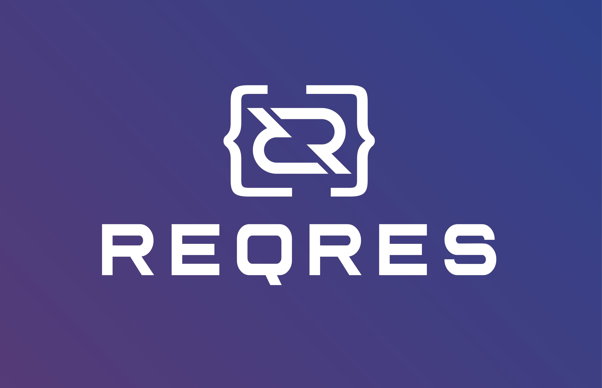
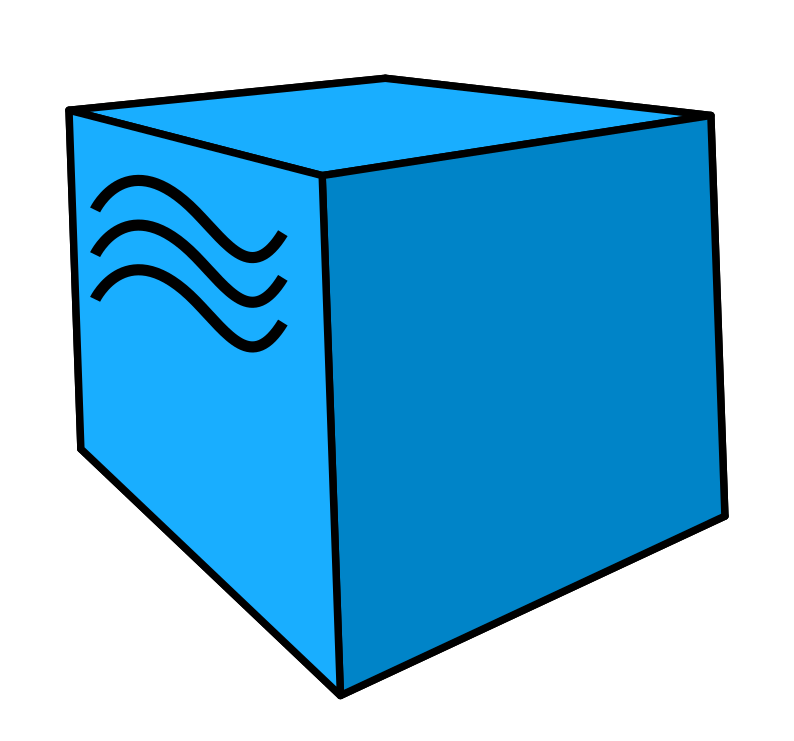
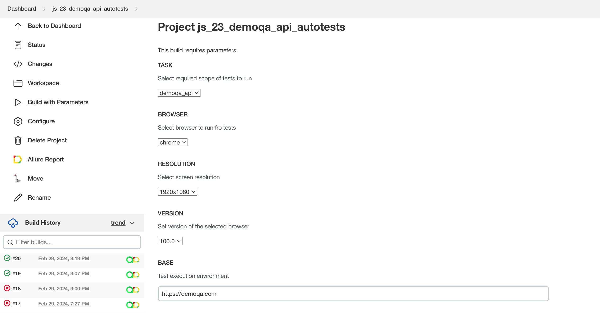
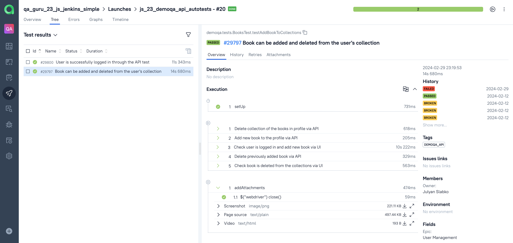
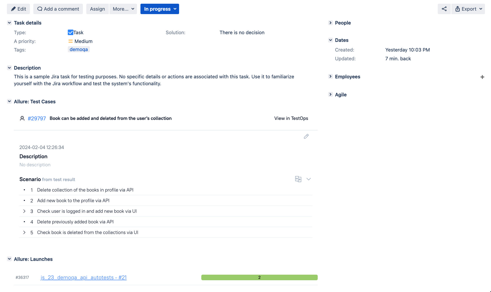
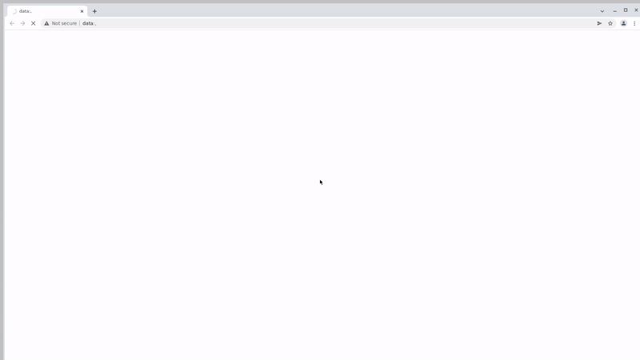

# Demo automation test project of the [Reqres.in](https://reqres.in/) API endpoints via [Rest-assured](https://www.browserstack.com/)



## Content

- <a href="#tools"> Tools</a>
- <a href="#cases"> Test Cases</a>
- <a href="#autotests"> Running Automated Tests</a>
- <a href="#jenkins"> Jenkins Build</a>
- <a href="#allureReport"> Example of Allure Report</a>
- <a href="#allure"> Integration with Allure TestOps</a>
- <a href="#jira"> Integration with Jira</a>
- <a href="#telegram"> Telegram notifications</a>
- <a href="#video"> Example of test execution (UI part only) </a>

____
<a id="tools"></a>
## 🛠️ Tools

<p align="center">
<a href="https://www.java.com/"></a>
<a href="https://selenide.org/"></a>
<a href="https://aerokube.com/selenoid/"></a>
<a href="https://allurereport.org/"></a>
<a href="https://qameta.io/"></a>
<a href="https://gradle.org/"></a>
<a href="https://junit.org/junit5/"></a>
<a href="https://www.jenkins.io/"></a>
<a href="https://web.telegram.org/"></a>
<a href="https://www.atlassian.com/ru/software/jira/"></a>
</p>

____
This repository contains a set of Java tests using the [RestAssured](https://rest-assured.io) library for various endpoints of the [Reqres.in](https://reqres.in/) API. The tests cover registration scenarios as well as user retrieval scenarios.


The contents of the Allure report for each test case include:
- Test steps and the results of their execution
- Screenshot of the page at the last step (to visually analyze why the test failed)
- Page Source (ability to open the page source in a new tab and see the reason for the test failure)
- Browser console logs
- Video (screen recording from Selenoid) of the test automation execution.

____
<a id="cases"></a>
## :male_detective: Test Cases

### Registration Tests:

#### 1. Successful Registration
- Validates that a user can successfully register with a valid email and password.
- Checks the response **status code is 200**, user ID, and token value in not null.

#### 2. Invalid Email Registration
- Verifies that registration fails with an invalid email.
- Ensures the response **status code is 400** and checks the expected error message.

#### 3. Empty Email Registration
- Tests the case where registration fails with an empty email.
- Ensures the response **status code is 400** and checks the expected error message.

#### 4. Empty Password Registration
- Tests the case where registration fails with an empty password.
- Ensures the response **status code is 400** and checks the expected error message.

---

### User Retrieval Tests

#### 5. **Single User Not Found**
- Verifies that attempting to retrieve a non-existent user returns a **404 status code**.

#### 6. **Single User Email**
- Validates that the email of a specific user can be retrieved successfully.
- Checks the response **status code is 200** and compares the retrieved email.

---


<a id="autotests"></a>
____
## :arrow_forward: Running Automated Tests

1. Ensure you have the necessary dependencies installed.
2. Update the base URI in the test file to match your Reqres.in API endpoint.
3. Run the tests and observe the results.

### Running Tests from the Terminal

#### Execution from the project's root directory:

<em> To run <b>all</b> the tests: </em>

```
gradle clean test 
```

____
<a id="jenkins"></a>
##  </a> Jenkins Build <a target="_blank"> </a>

Registration on the [Jenkins](https://jenkins.autotests.cloud/) resource is required for access to Jenkins.

To start the build, go to the "Build with parameters" section, select the necessary parameters, and click "Build".
### Jenkins Build Parameters:
- TASK (set scope/task to execute)
- COMMENT (optional parameter to add notes that will be displayed in report)

<p align="center">

</p>
After the build is completed, icons for "Allure Report" and "Allure TestOps" will appear next to the build number in the "Build History" section. Clicking on these icons opens pages with the generated HTML report and test documentation, respectively.

____
<a id="allureReport"></a>
##  </a> Example of <a target="_blank" href="https://jenkins.autotests.cloud/"> Allure Report </a>

<p align="center">

</p>

____
<a id="allure"></a>
##  </a> Integration with <a target="_blank" href="https://allure.autotests.cloud/"> Allure TestOps </a>

On the *Dashboard* in **Allure TestOps**, you can see the statistics of the number of tests: how many of them are added and executed manually, how many are automated. New tests and test run results are sent through the integration with each build.

<p align="center">

</p>

<p align="center">

</p>

<p align="center">

</p>

____
<a id="jira"></a>
##  </a> Integration with <a target="_blank" href="https://jira.autotests.cloud/"> Jira </a>

Integration with **Allure TestOps** and **Jira** is implemented. In the Jira task, you can see which test cases were written as part of the task and their execution results.

<p align="center">

</p>

____
<a id="telegram"></a>
##  Automatically generated report notification in <a target="_blank" href="https://telegram.org/"> Telegram </a> via Bot

After the build is complete, a **Telegram** bot automatically processes and sends a message with the test run report to a specifically configured chat.

<p align="left">

</p>

____
<a id="video"></a>
##  </a> Video attachment example

In the Allure reports for each test, a video of the test execution is attached along with a screenshot.

<p align="left">
  
</p>
