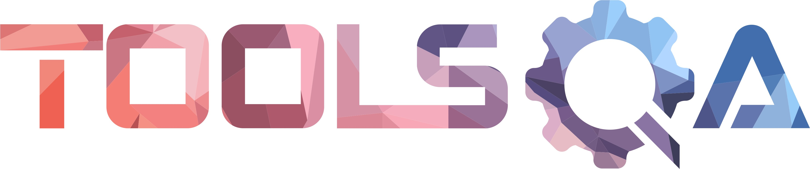

# Demo project with optimized UI Test vy API-Prepared Authentication




Illustrative example of the interaction between API and UI automation, showcasing the capabilities of testing automation across different levels of the application.

## Content

- <a href="#tools"> Tools</a>
- <a href="#steps"> Steps</a>
- <a href="#autotests"> Running Automated Tests</a>
- <a href="#jenkins"> Jenkins Build</a>
- <a href="#allureReport"> Example of Allure Report</a>
- <a href="#allure"> Integration with Allure TestOps</a>
- <a href="#jira"> Integration with Jira</a>
- <a href="#telegram"> Telegram notifications</a>
- <a href="#video"> Example of test execution (UI part only) </a>

____
<a id="tools"></a>
## 🛠️ Tools

<p align="center">
<a href="https://www.java.com/"></a>
<a href="https://selenide.org/"></a>
<a href="https://aerokube.com/selenoid/"></a>
<a href="https://allurereport.org/"></a>
<a href="https://qameta.io/"></a>
<a href="https://gradle.org/"></a>
<a href="https://junit.org/junit5/"></a>
<a href="https://www.jenkins.io/"></a>
<a href="https://web.telegram.org/"></a>
<a href="https://www.atlassian.com/ru/software/jira/"></a>
</p>

____
<a id="steps"></a>
## 🗒️ Test steps

#### API part:

- **Login to [Demo QA](https://demoqa.com/):** An automated login process to the Demo QA platform.
- **Adding a Book via API:** Utilizing API requests to add a book to the system.

#### UI part:
- **Deleting a Book via UI:** Deleting the previously added book through the web application's UI.
- **Verification of Deletion:** Confirming the successful deletion of the book by verifying its absence from the list.

---

<a id="autotests"></a>
____
## :arrow_forward: Running Automated Tests

1. Ensure you have the necessary dependencies installed.
2. Update the base URI in the test file to match your [Demo QA](https://demoqa.com/) API endpoint.
3. Run the tests and observe the results.

### Running Tests from the Terminal

#### Execution from the project's root directory:

<em> To run <b>all</b> the tests: </em>

```
gradle clean demoqa_api
```

____
<a id="jenkins"></a>
##  </a> Jenkins Build <a target="_blank"> </a>

To start the build, go to the "Build with parameters" section, select the necessary parameters, and click "Build".
### Jenkins Build Parameters:
- TASK (set scope/task to execute)
- COMMENT (optional parameter to add notes that will be displayed in report)

<p align="center">

</p>
After the build is completed, icons for "Allure Report" and "Allure TestOps" will appear next to the build number in the "Build History" section. Clicking on these icons opens pages with the generated HTML report and test documentation, respectively.

<br>
<br>

> Registration on the [Jenkins](https://jenkins.autotests.cloud/) resource is required for access to Jenkins.

____
<a id="allureReport"></a>
##  </a> Example of <a target="_blank" href="https://jenkins.autotests.cloud/"> Allure Report </a>

<p align="center">

</p>

____
<a id="allure"></a>
##  </a> Integration with <a target="_blank" href="https://allure.autotests.cloud/"> Allure TestOps </a>

On the *Dashboard* in **Allure TestOps**, you can see the statistics of the number of tests: how many of them are added and executed manually, how many are automated. New tests and test run results are sent through the integration with each build.

<p align="center">

</p>

____
<a id="jira"></a>
##  </a> Integration with <a target="_blank" href="https://jira.autotests.cloud/"> Jira </a>

Integration with **Allure TestOps** and **Jira** is implemented. In the Jira task, you can see which test cases were written as part of the task and their execution results.

<p align="center">

</p>

____
<a id="telegram"></a>
##  Report notification in <a target="_blank" href="https://telegram.org/"> Telegram </a> via Bot

After the build is complete, a **Telegram** bot automatically processes and sends a message with the test run report to a specifically configured chat.

<p align="left">

</p>

____
<a id="video"></a>
##  </a> Video attachment example (UI part only)

In the Allure reports for each test, a video of the test execution is attached along with a screenshot.

<p align="left">
  
</p>
